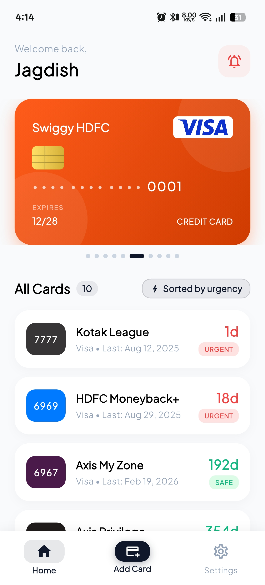
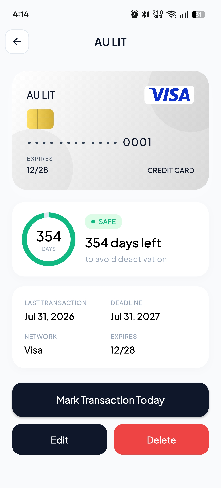
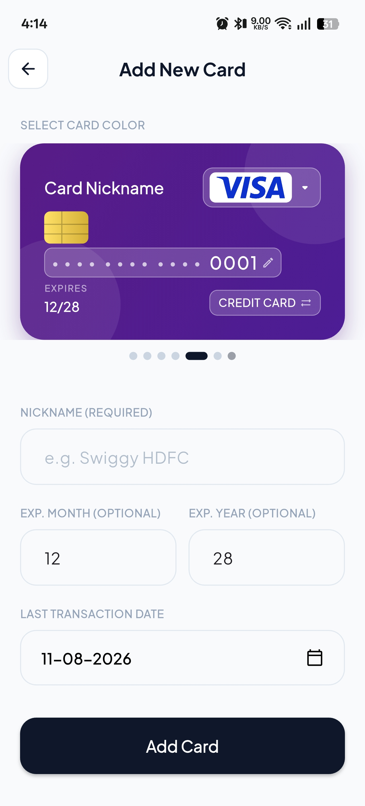

# CardMinder

An Android app that keeps your credit and debit cards from getting deactivated due to inactivity.

Most banks quietly deactivate a card if you don't use it for 365 days. I kept forgetting to swipe cards I don't use often, so I built this to track the last transaction date on each card and remind me before the deadline hits.

## What it does

- Tracks the last transaction date for each card and counts down to the 365 day deactivation deadline
- Home screen widget that shows up to 5 cards at once with live countdowns
- Notifies you 30, 14, 7, and 1 day before a card is about to go inactive
- Keeps a log of past notifications so you can see what you missed
- Everything is stored locally on your phone, nothing is sent anywhere

## How it works

Add a card with its nickname, last four digits, network, and the date you last used it. The app calculates when it'll hit the 365 day mark and starts counting down. When you actually use the card, just open it and tap the button to log a new transaction, which resets the timer.

The widget on your home screen shows your cards sorted by urgency so the ones about to expire are easy to spot. You can filter it to only show cards that are getting close to the deadline, and choose how many cards it displays.

## Screens

- **Home**: a carousel of your cards plus a list sorted by urgency (safe, warning, urgent)
- **Card details**: shows days remaining, last transaction date, deadline, and lets you log a new transaction or edit/delete the card
- **Add/Edit card**: a live preview of the card as you fill in the form, with a color picker for the card design
- **Settings**: control widget size, filtering, sorting, and notification toggles
- **Notification history**: a simple log of every reminder that's been sent
## Screenshots

<p align="center">
  
  
  
</p>
## Installation

You can download the latest APK from the [releases page](https://github.com/GamerJagdish/cardminder/releases).

If you'd rather build it yourself, clone the repo and use Flutter:

```bash
git clone https://github.com/GamerJagdish/cardminder.git
cd cardminder
flutter pub get
flutter run
```

To build a release APK:

```bash
flutter build apk --release
```

You'll find it at `build/app/outputs/flutter-apk/app-release.apk`.

## Contributing

Contributions, bug reports, and feature requests are welcome. Feel free to open an issue or a pull request.

## Support

If you find this useful, consider supporting the project:

<a href="https://www.buymeacoffee.com/gamerjagdish" target="_blank" title="buymeacoffee">
  
</a>

<a href="https://www.ko-fi.com/gamerjagdish" target="_blank" title="ko-fi">
  
</a>

## License

Distributed under the [MIT License](LICENSE).